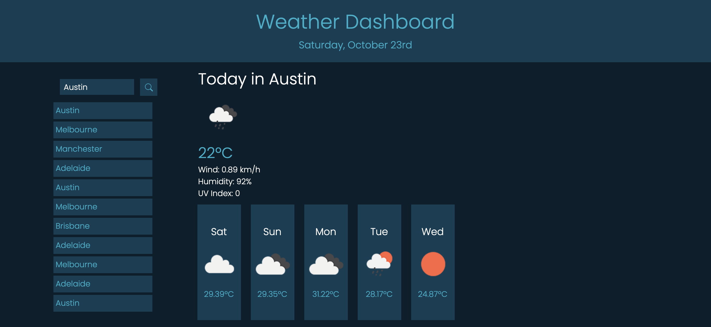
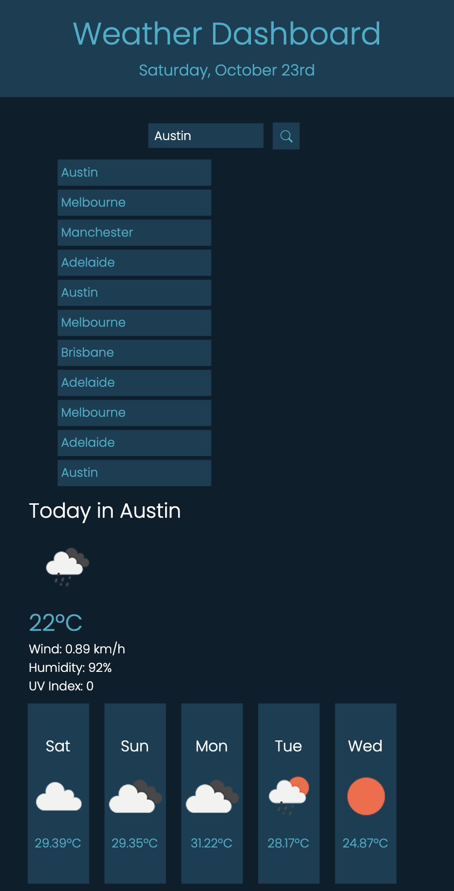

# Weather Dashboard

## Description
Third party API's (Application Programming Interface) are predominately used by developers to gain access to data (using keys) via JavaScript to use on other sites and applications. 

Using the third party weather API - OpenWeather, I was tasked with making a weather dashboard to retrieve and display the local weather forecast for a seached city from anywhere in the world.

## User Story

```
AS A traveler
I WANT to see the weather outlook for multiple cities
SO THAT I can plan a trip accordingly
```

## Acceptance Criteria
```
GIVEN a weather dashboard with form inputs
WHEN I search for a city
THEN I am presented with current and future conditions for that city and that city is added to the search history
WHEN I view current weather conditions for that city
THEN I am presented with the city name, the date, an icon representation of weather conditions, the temperature, the humidity, the wind speed, and the UV index
WHEN I view the UV index
THEN I am presented with a color that indicates whether the conditions are favorable, moderate, or severe
WHEN I view future weather conditions for that city
THEN I am presented with a 5-day forecast that displays the date, an icon representation of weather conditions, the temperature, the wind speed, and the humidity
WHEN I click on a city in the search history
THEN I am again presented with current and future conditions for that city
```

## Mock up
For my weather dashboard, I chose to stick with simple blues for the color scheme using the css colors #fff, #51acc5, #1c3d52 and #0e1e2b.

   

Below is my final weather dashboard:


* when the browser is opened, the user is greeted with the current day and date and a search bar to enter in a city.

* once a city is entered, the city will be added to the recent search history displayed on screen.

* the current weather forecast (including temp in celsius, wind speed, humidity and uv index) for that city will be displayed.

* underneath the current weather, the basic forecast for that city over the next 5 days will be shown.


My weather dashboard is also mobile responsive.


## Final Comments
I found this to be a bit of a challenge as I had not worked with third party API's before. I would like to work on this in the future and add buttons to the search list items so the user has the option to clear some of their city searches.

